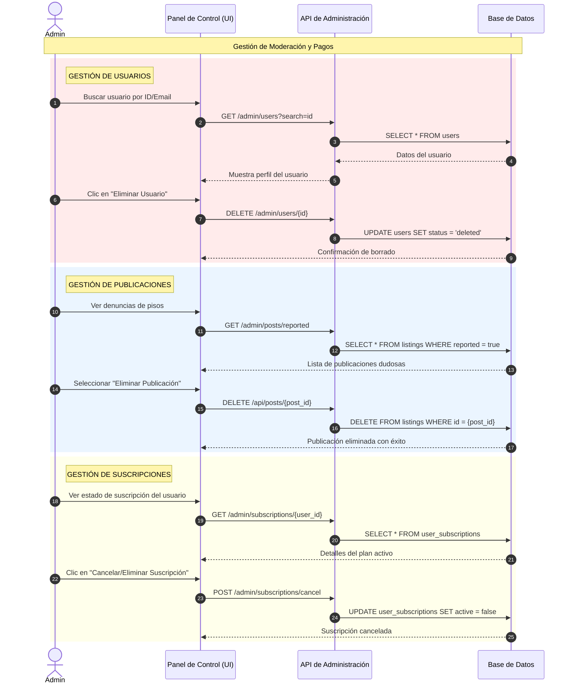

```mermaid
sequenceDiagram
    autonumber
    actor Admin
    participant Dashboard as Panel de Control (UI)
    participant API as API de Administración
    participant DB as Base de Datos

    Note over Admin, DB: Gestión de Moderación y Pagos

    %% Gestión de Usuarios
    rect rgb(255, 235, 235)
    Note right of Admin: GESTIÓN DE USUARIOS
    Admin->>Dashboard: Buscar usuario por ID/Email
    Dashboard->>API: GET /admin/users?search=id
    API->>DB: SELECT * FROM users
    DB-->>API: Datos del usuario
    API-->>Dashboard: Muestra perfil del usuario
    Admin->>Dashboard: Clic en "Eliminar Usuario"
    Dashboard->>API: DELETE /admin/users/{id}
    API->>DB: UPDATE users SET status = 'deleted'
    DB-->>Dashboard: Confirmación de borrado
    end

    %% Gestión de Publicaciones (Pisos)
    rect rgb(235, 245, 255)
    Note right of Admin: GESTIÓN DE PUBLICACIONES
    Admin->>Dashboard: Ver denuncias de pisos
    Dashboard->>API: GET /admin/posts/reported
    API->>DB: SELECT * FROM listings WHERE reported = true
    DB-->>Dashboard: Lista de publicaciones dudosas
    Admin->>Dashboard: Seleccionar "Eliminar Publicación"
    Dashboard->>API: DELETE /api/posts/{post_id}
    API->>DB: DELETE FROM listings WHERE id = {post_id}
    DB-->>Dashboard: Publicación eliminada con éxito
    end

    %% Gestión de Suscripciones
    rect rgb(255, 255, 235)
    Note right of Admin: GESTIÓN DE SUSCRIPCIONES
    Admin->>Dashboard: Ver estado de suscripción del usuario
    Dashboard->>API: GET /admin/subscriptions/{user_id}
    API->>DB: SELECT * FROM user_subscriptions
    DB-->>Dashboard: Detalles del plan activo
    Admin->>Dashboard: Clic en "Cancelar/Eliminar Suscripción"
    Dashboard->>API: POST /admin/subscriptions/cancel
    API->>DB: UPDATE user_subscriptions SET active = false
    DB-->>Dashboard: Suscripción cancelada
    end
```