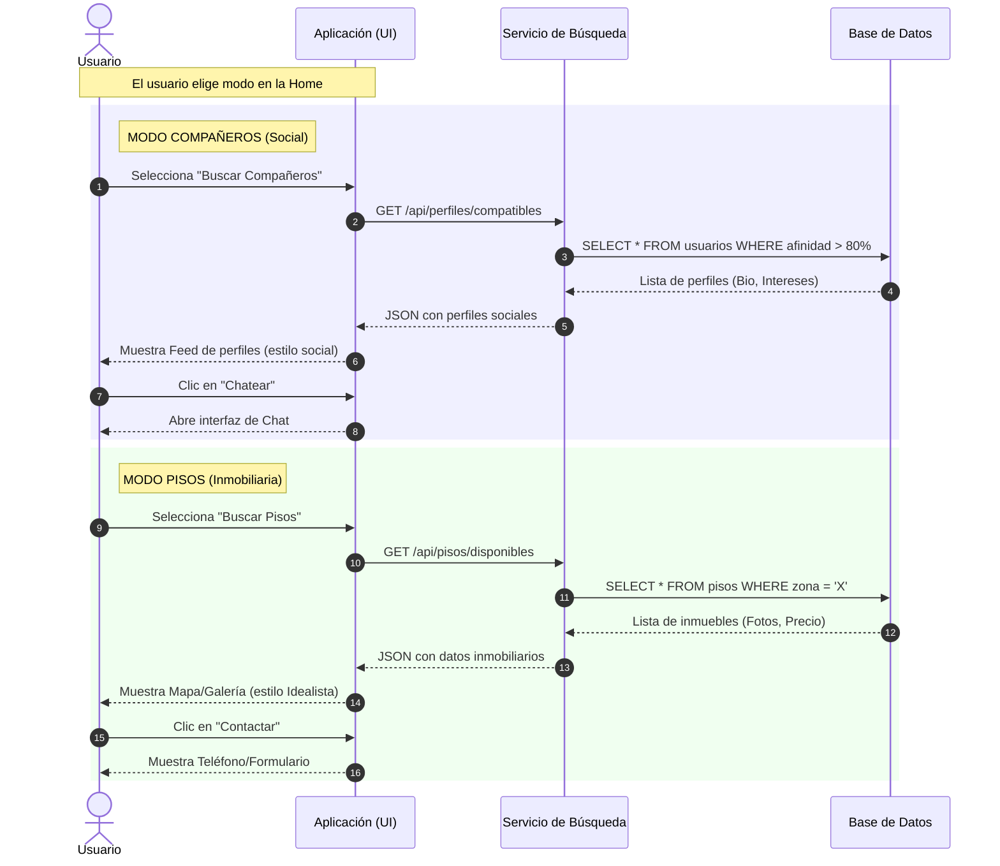

```mermaid
sequenceDiagram
    autonumber
    actor Usuario
    participant App as Aplicación (UI)
    participant Buscador as Servicio de Búsqueda
    participant DB as Base de Datos

    Note over Usuario, App: El usuario elige modo en la Home

    %% Flujo de Compañeros
    rect rgb(240, 240, 255)
    Note right of Usuario: MODO COMPAÑEROS (Social)
    Usuario->>App: Selecciona "Buscar Compañeros"
    App->>Buscador: GET /api/perfiles/compatibles
    Buscador->>DB: SELECT * FROM usuarios WHERE afinidad > 80%
    DB-->>Buscador: Lista de perfiles (Bio, Intereses)
    Buscador-->>App: JSON con perfiles sociales
    App-->>Usuario: Muestra Feed de perfiles (estilo social)
    Usuario->>App: Clic en "Chatear"
    App-->>Usuario: Abre interfaz de Chat
    end

    %% Flujo de Pisos
    rect rgb(240, 255, 240)
    Note right of Usuario: MODO PISOS (Inmobiliaria)
    Usuario->>App: Selecciona "Buscar Pisos"
    App->>Buscador: GET /api/pisos/disponibles
    Buscador->>DB: SELECT * FROM pisos WHERE zona = 'X'
    DB-->>Buscador: Lista de inmuebles (Fotos, Precio)
    Buscador-->>App: JSON con datos inmobiliarios
    App-->>Usuario: Muestra Mapa/Galería (estilo Idealista)
    Usuario->>App: Clic en "Contactar"
    App-->>Usuario: Muestra Teléfono/Formulario
    end
```