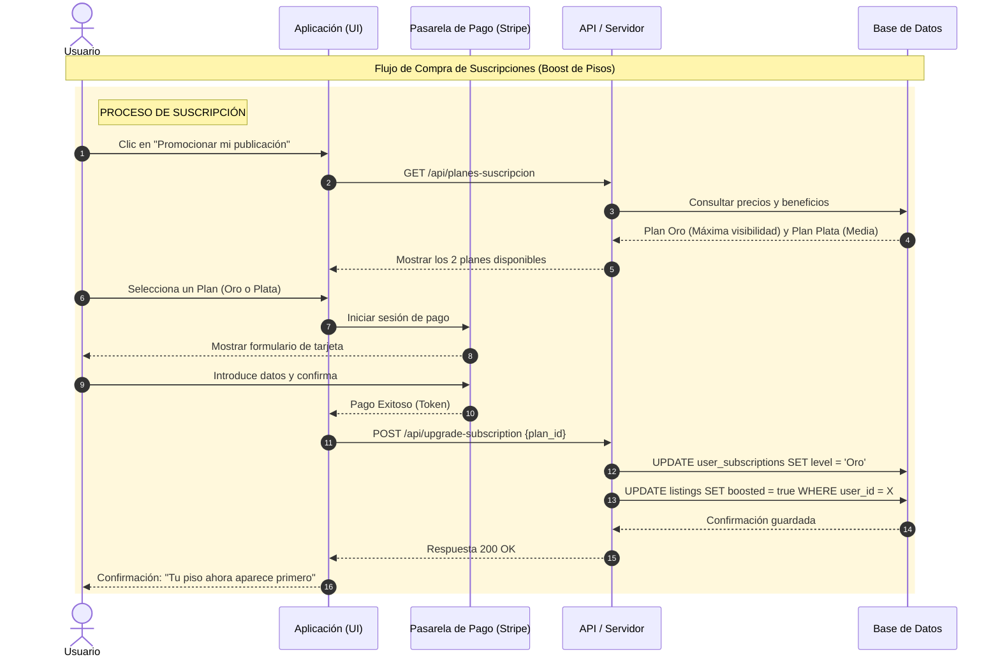

```mermaid
sequenceDiagram
    autonumber
    actor Usuario
    participant App as Aplicación (UI)
    participant Pasarela as Pasarela de Pago (Stripe)
    participant API as API / Servidor
    participant DB as Base de Datos

    Note over Usuario, DB: Flujo de Compra de Suscripciones (Boost de Pisos)

    rect rgb(255, 248, 220)
    Note right of Usuario: PROCESO DE SUSCRIPCIÓN
    Usuario->>App: Clic en "Promocionar mi publicación"
    App->>API: GET /api/planes-suscripcion
    API->>DB: Consultar precios y beneficios
    DB-->>API: Plan Oro (Máxima visibilidad) y Plan Plata (Media)
    API-->>App: Mostrar los 2 planes disponibles
    
    Usuario->>App: Selecciona un Plan (Oro o Plata)
    App->>Pasarela: Iniciar sesión de pago
    Pasarela-->>Usuario: Mostrar formulario de tarjeta
    Usuario->>Pasarela: Introduce datos y confirma
    Pasarela-->>App: Pago Exitoso (Token)
    
    App->>API: POST /api/upgrade-subscription {plan_id}
    API->>DB: UPDATE user_subscriptions SET level = 'Oro'
    API->>DB: UPDATE listings SET boosted = true WHERE user_id = X
    DB-->>API: Confirmación guardada
    API-->>App: Respuesta 200 OK
    App-->>Usuario: Confirmación: "Tu piso ahora aparece primero"
    end
```