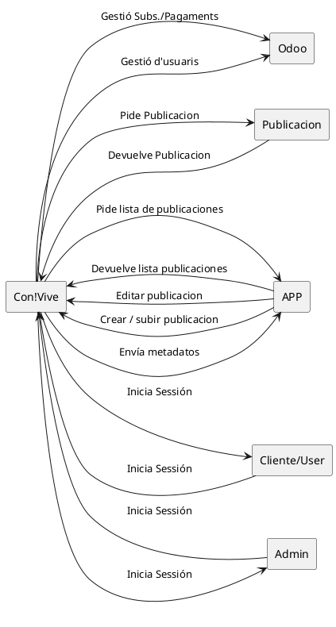

# Diagrama C4 Nivell 1

```plantuml
@startuml
left to right direction

rectangle "Con!Vive" as MAIN


rectangle "Odoo" as Odoo
rectangle "Publicacion" as Publicacion
rectangle "APP" as APP
rectangle "Cliente/User" as User
rectangle "Admin" as Admin


MAIN --> Odoo : Gestió Subs./Pagaments
MAIN --> Odoo : Gestió d'usuaris

MAIN --> Publicacion : Pide Publicacion
MAIN <-- Publicacion :  Devuelve Publicacion

MAIN --> APP : Pide lista de publicaciones
MAIN <-- APP : Devuelve lista publicaciones

MAIN <-- APP : Editar publicacion
MAIN <-- APP : Crear / subir publicacion
MAIN --> APP : Envía metadatos

MAIN --> User : Inicia Sessión
MAIN <-- User : Inicia Sessión

MAIN <-- Admin : Inicia Sessión
MAIN --> Admin : Inicia Sessión

@enduml
```
