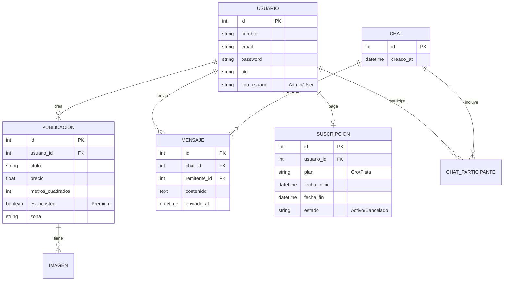

```mermaid
erDiagram
    USUARIO ||--o{ PUBLICACION : "crea"
    USUARIO ||--o{ MENSAJE : "envía"
    USUARIO ||--o| SUSCRIPCION : "paga"
    
    PUBLICACION ||--o{ IMAGEN : "tiene"
    
    CHAT ||--o{ MENSAJE : "contiene"
    USUARIO ||--o{ CHAT_PARTICIPANTE : "participa"
    CHAT ||--o{ CHAT_PARTICIPANTE : "incluye"

    USUARIO {
        int id PK
        string nombre
        string email
        string password
        string bio
        string tipo_usuario "Admin/User"
    }

    PUBLICACION {
        int id PK
        int usuario_id FK
        string titulo
        float precio
        int metros_cuadrados
        boolean es_boosted "Premium"
        string zona
    }

    SUSCRIPCION {
        int id PK
        int usuario_id FK
        string plan "Oro/Plata"
        datetime fecha_inicio
        datetime fecha_fin
        string estado "Activo/Cancelado"
    }

    MENSAJE {
        int id PK
        int chat_id FK
        int remitente_id FK
        text contenido
        datetime enviado_at
    }

    CHAT {
        int id PK
        datetime creado_at
    }
```