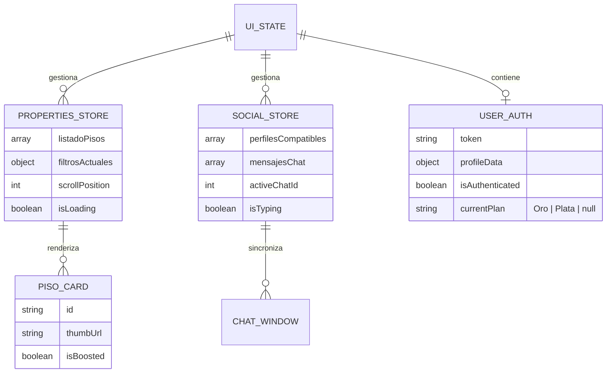

```mermaid
erDiagram
    UI_STATE ||--o{ PROPERTIES_STORE : "gestiona"
    UI_STATE ||--o{ SOCIAL_STORE : "gestiona"
    UI_STATE ||--o| USER_AUTH : "contiene"

    USER_AUTH {
        string token
        object profileData
        boolean isAuthenticated
        string currentPlan "Oro | Plata | null"
    }

    PROPERTIES_STORE {
        array listadoPisos
        object filtrosActuales
        int scrollPosition
        boolean isLoading
    }

    SOCIAL_STORE {
        array perfilesCompatibles
        array mensajesChat
        int activeChatId
        boolean isTyping
    }

    PROPERTIES_STORE ||--o{ PISO_CARD : "renderiza"
    SOCIAL_STORE ||--o{ CHAT_WINDOW : "sincroniza"

    PISO_CARD {
        string id
        string thumbUrl
        boolean isBoosted
    }
```