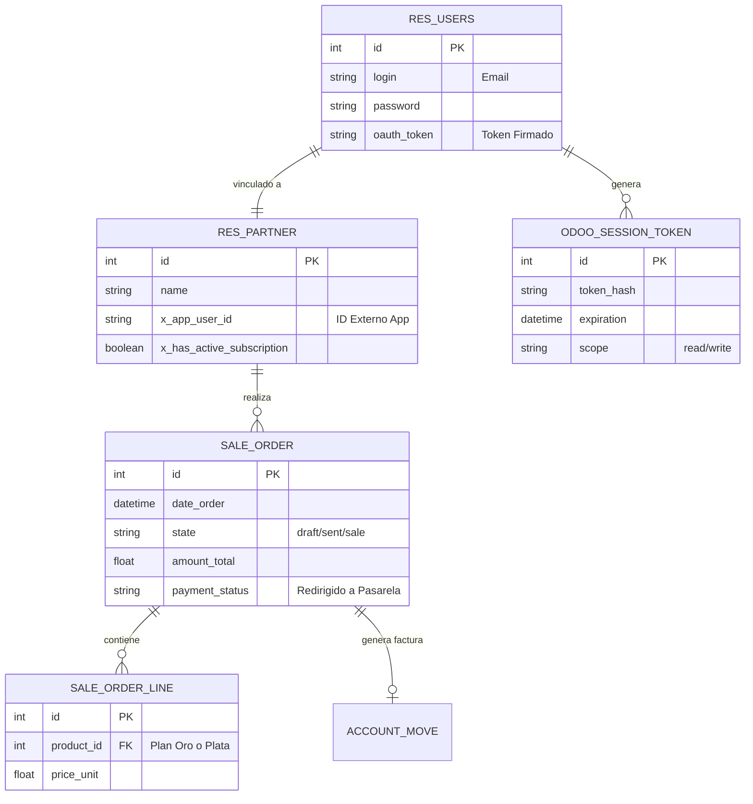

```mermaid
erDiagram
    RES_USERS ||--|| RES_PARTNER : "vinculado a"
    RES_USERS ||--o{ ODOO_SESSION_TOKEN : "genera"
    RES_PARTNER ||--o{ SALE_ORDER : "realiza"
    SALE_ORDER ||--o{ SALE_ORDER_LINE : "contiene"
    SALE_ORDER ||--o| ACCOUNT_MOVE : "genera factura"
    
    RES_USERS {
        int id PK
        string login "Email"
        string password
        string oauth_token "Token Firmado"
    }

    RES_PARTNER {
        int id PK
        string name
        string x_app_user_id "ID Externo App"
        boolean x_has_active_subscription
    }

    ODOO_SESSION_TOKEN {
        int id PK
        string token_hash
        datetime expiration
        string scope "read/write"
    }

    SALE_ORDER {
        int id PK
        datetime date_order
        string state "draft/sent/sale"
        float amount_total
        string payment_status "Redirigido a Pasarela"
    }

    SALE_ORDER_LINE {
        int id PK
        int product_id FK "Plan Oro o Plata"
        float price_unit
    }
```